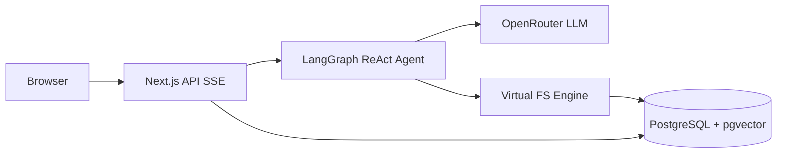
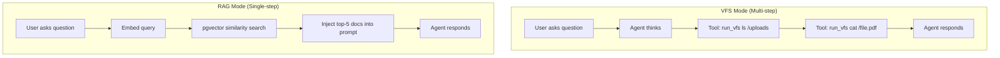
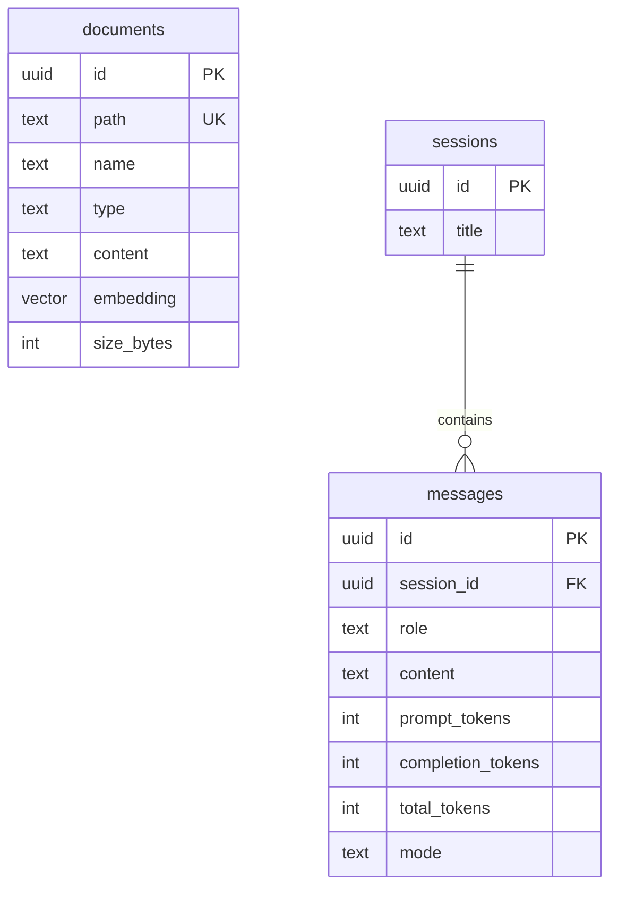
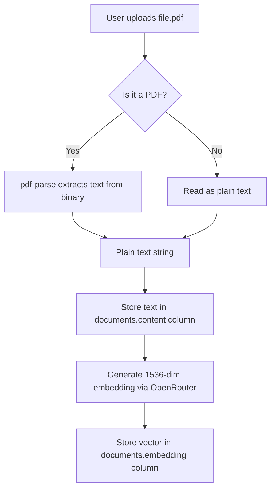
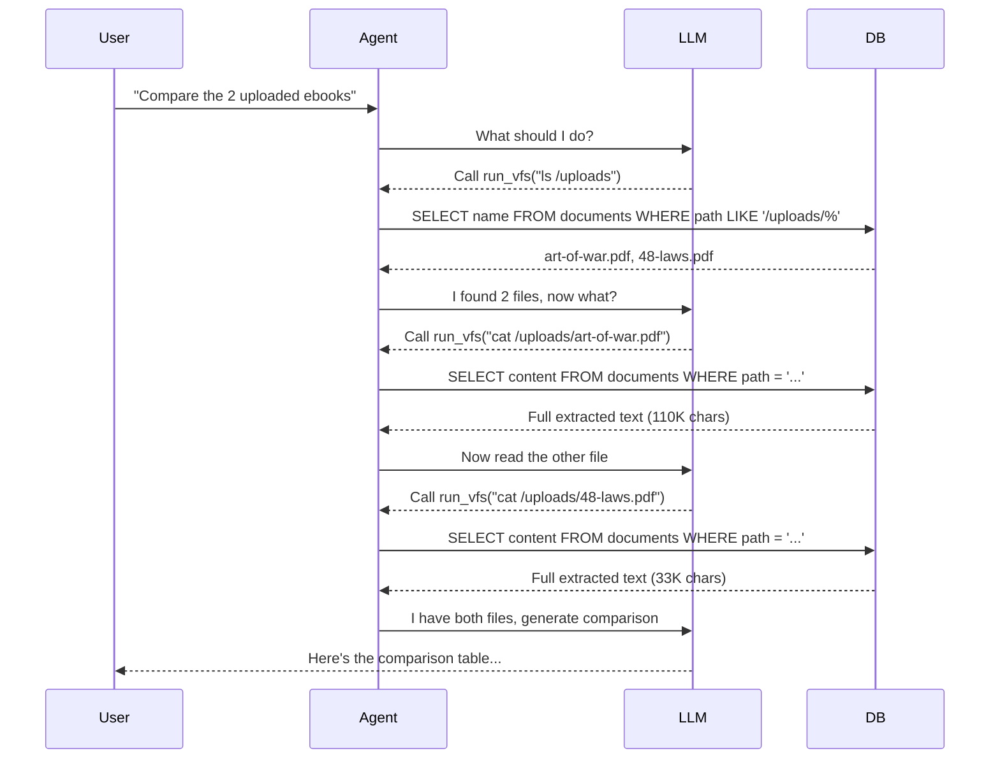
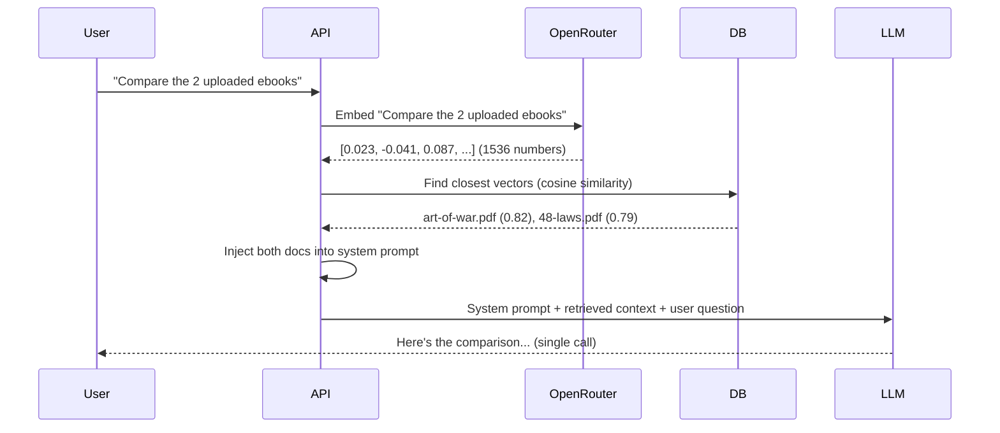

# Virtual FS + AI Agent Engine

An AI agent that reasons over a **Virtual File System** backed by PostgreSQL. Files don't live on disk — they live in a database. The agent uses terminal commands (`ls`, `cat`, `grep`) to browse, read, and search project data.

This project compares two approaches side-by-side: **VFS (Virtual File System)** vs **RAG (Retrieval-Augmented Generation)** — measuring token consumption and response quality for each.

## Architecture



## Two Modes: VFS vs RAG

The UI has a toggle to switch between modes. Both read from the same `documents` table.



### Token Consumption Comparison

Real-world test: "Compare 2 uploaded ebooks" (Art of War PDF + 48 Laws PDF)

| Metric | VFS Mode | RAG Mode |
|--------|---------|---------|
| **Prompt tokens** | 1.3K | 1.0K |
| **Completion tokens** | 85 | 96 |
| **Total tokens** | 1.4K | 1.0K |
| **LLM calls** | 2-3 (tool loop) | 1 (single call) |
| **Latency** | Higher (sequential tools) | Lower (one round-trip) |

### Pros & Cons

| Aspect | VFS (Virtual File System) | RAG (Retrieval-Augmented Generation) |
|--------|--------------------------|--------------------------------------|
| **How it works** | Agent browses files with `ls`, `cat`, `grep` — multiple LLM calls | Relevant chunks retrieved via embedding similarity, injected into prompt — single LLM call |
| **Token efficiency** | Higher cost — each tool call is a full LLM round-trip with growing context | Lower cost — context retrieved upfront, single inference |
| **Accuracy** | High — agent reads exact file content, can explore freely | Depends on embedding quality — may miss relevant sections |
| **Flexibility** | Agent can discover files it didn't know about (`find`, `grep`) | Limited to top-K retrieved chunks, no exploration |
| **Large files** | Reads full content via `cat` — accurate but token-heavy | Truncated to 2,000 chars per chunk — may lose detail |
| **Best for** | Exploratory questions ("what files exist?", "search for X") | Direct questions about known content ("summarize this PDF") |
| **Latency** | Slower — multiple sequential API calls | Faster — single API call after retrieval |
| **Scaling** | Tokens grow with file count and tool calls | Tokens grow with top-K and chunk size (predictable) |

### When to Use Which

- **VFS**: When the user doesn't know what's in the files and needs the agent to explore
- **RAG**: When the user asks about specific content and wants fast, token-efficient answers

## Tech Stack

| Layer | Technology |
|-------|-----------|
| Frontend | Next.js 16 + Tailwind CSS + shadcn/ui |
| Agent | LangGraph ReAct Agent |
| LLM | OpenRouter (Kimi K2, Claude, GPT-4o) |
| Virtual FS | Custom IFileSystem (TreeBuilder + CacheLayer + GrepOptimizer) |
| Vector DB | PostgreSQL + pgvector (cosine similarity, IVFFlat index) |
| Embeddings | OpenAI text-embedding-3-small via OpenRouter |
| Streaming | Server-Sent Events (SSE) with live tool activity |

## Database Schema



## Features

- Upload documents (PDF, text, code) — auto-extracted and embedded
- VFS mode: agent browses with `ls`, `cat`, `grep`, `find`
- RAG mode: pgvector similarity search, single LLM call
- Token tracking per message (prompt/completion/total)
- Mode badge on each response (VFS orange / RAG blue)
- Live activity streaming (SSE: "Running: ls /uploads", "Thinking...")
- Dark mode, markdown rendering with GFM tables
- Session management (create, switch, delete)

## Getting Started

### Prerequisites

- Node.js 20+
- PostgreSQL 14+ with pgvector extension

### Setup

```bash
cd chatbot

# Install dependencies
npm install

# Configure environment
cp .env.example .env.local
# Edit with your OpenRouter API key and DATABASE_URL

# Run database migrations
npm run db:migrate

# Enable pgvector (if not already)
psql -d chatbot -c "CREATE EXTENSION IF NOT EXISTS vector"

# Start dev server
npm run dev
```

### Environment Variables

```env
OPENROUTER_API_KEY=sk-or-v1-...
DEFAULT_MODEL=moonshotai/kimi-k2
DATABASE_URL=postgresql://user@localhost:5432/chatbot
```

### Scripts

| Command | Description |
|---------|-------------|
| `npm run dev` | Start development server |
| `npm run build` | Production build |
| `npm run db:migrate` | Apply database migrations |
| `npm run db:seed` | Seed demo documents |

## How It Works

### Step 1: Document Upload (Same for Both Modes)

When a user uploads a file, it goes through a pipeline that prepares it for **both** VFS and RAG:



**Key point:** PDFs are binary files, but we **never store the binary**. The `pdf-parse` library extracts readable text at upload time. The database only holds plain text. When the agent later runs `cat /uploads/file.pdf`, it gets the extracted text, not binary data.

After upload, each document has two representations in PostgreSQL:

| Column | Used by | What it stores |
|--------|---------|----------------|
| `content` (text) | VFS mode | Full extracted text (can be 100K+ chars) |
| `embedding` (vector) | RAG mode | 1536 numbers representing the text's meaning |

### Step 2A: VFS Mode — Agent Browses Files

The agent acts like a developer in a terminal. It decides which commands to run:



**VFS reads the `content` column directly.** Embeddings are not involved. Each `cat` command is a separate database query and a new LLM round-trip.

### Step 2B: RAG Mode — Documents Pre-Fetched by Similarity

No file browsing. Relevant documents are found mathematically and injected before the LLM thinks:



**RAG reads the `embedding` column for search, then `content` for context injection.** The agent never runs `ls` or `cat` — the documents are already in the prompt.

### How Embeddings Work (RAG Only)

Embeddings convert text into numbers that capture meaning. Similar texts have similar numbers.

```
"military strategy and war tactics"     → [0.23, -0.04, 0.87, ...]
"power dynamics and social manipulation" → [0.19, -0.11, 0.72, ...]
"chocolate cake recipe"                 → [-0.45, 0.33, -0.12, ...]
```

When you ask "compare the ebooks about strategy":
1. Your question becomes a vector: `[0.21, -0.06, 0.81, ...]`
2. pgvector compares it against every document's vector using cosine distance
3. Art of War (0.82 similarity) and 48 Laws (0.79) are closest
4. Chocolate cake recipe (0.12) is far away — not returned

VFS mode **ignores embeddings entirely** — it reads files by path, not by meaning.

### Side-by-Side: Same Question, Different Approaches

**Question:** "What's in my uploaded PDFs?"

| Step | VFS Mode | RAG Mode |
|------|---------|---------|
| 1 | LLM decides to run `ls /uploads` | Embed the question into a vector |
| 2 | DB returns file list | pgvector finds top-5 similar documents |
| 3 | LLM decides to `cat` each file | Inject document text into prompt |
| 4 | DB returns full text per file | Single LLM call with context |
| 5 | LLM reads text, responds | LLM reads injected context, responds |
| **DB queries** | 3+ (ls + cat per file) | 2 (embed + vector search) |
| **LLM calls** | 3-5 (tool loop) | 1 (single inference) |
| **Content seen** | Full file (100K+ chars) | Truncated 2K chars per doc |
| **Embeddings used** | No | Yes |
