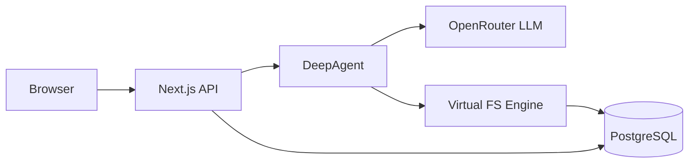
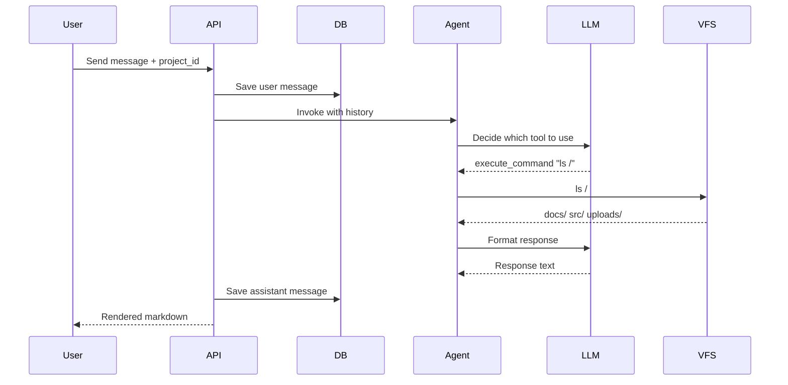
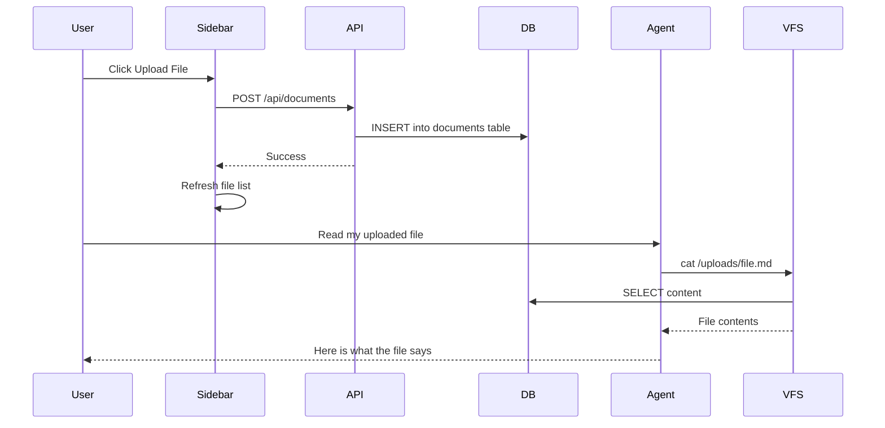
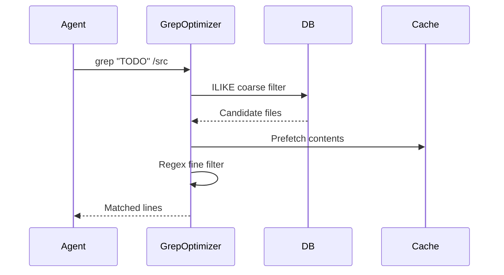
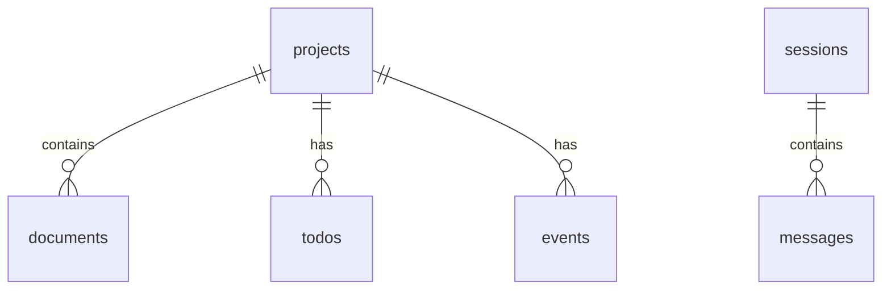

# Virtual FS + AI Agent Engine

An AI agent that reasons over a **Virtual File System** backed by PostgreSQL. Files don't live on disk — they live in a database. The agent uses terminal commands (`ls`, `cat`, `grep`) to browse, read, and search project data, while managing context dynamically without exceeding token limits.

## Architecture Overview



**Layers:**
- **Browser** — Chat UI with session sidebar, document list, model selector
- **Next.js API** — Routes for `/api/chat`, `/api/sessions`, `/api/documents`
- **DeepAgent** — LangGraph agent with 5 tools (execute_command, create_task, update_task, create_event, search_docs)
- **Virtual FS Engine** — TreeBuilder + CacheLayer + GrepOptimizer + just-bash
- **PostgreSQL** — Stores files, sessions, messages, tasks, events
- **OpenRouter** — LLM gateway (Kimi K2, Claude, GPT-4o)

## How It Works

### Flow 1: User Chats with the Agent



### Flow 2: User Uploads a Document



### Flow 3: Grep Search (Coarse to Fine)



## Tech Stack

| Layer | Technology |
|-------|-----------|
| Frontend | Next.js 16 + Tailwind CSS + shadcn/ui |
| Agent | DeepAgents (LangGraph) |
| LLM | OpenRouter (Kimi K2, Claude, GPT-4o) |
| Virtual FS | just-bash + custom IFileSystem |
| Database | PostgreSQL + Drizzle ORM |

## Project Structure

```
chatbot/
├── src/
│   ├── app/                    # Next.js pages + API routes
│   │   ├── page.tsx            # Main chat page
│   │   └── api/
│   │       ├── chat/           # POST - agent conversation
│   │       ├── documents/      # GET/POST - file upload & list
│   │       └── sessions/       # CRUD - chat sessions
│   ├── components/             # UI components
│   │   ├── chat/               # ChatBubble, ChatInput, ChatHeader
│   │   ├── session/            # SessionSidebar, DocumentList
│   │   └── common/             # EmptyState, TypingIndicator
│   ├── features/               # Business logic hooks
│   │   ├── chat/               # useChat, useSendMessage
│   │   ├── session/            # useSessions, useSessionManager
│   │   └── documents/          # useDocuments
│   └── lib/
│       ├── agent/              # DeepAgent, tools, system prompt
│       ├── db/                 # Drizzle schema + connection
│       └── fs/                 # TreeBuilder, VirtualFs, GrepOptimizer, CacheLayer
├── scripts/
│   ├── seed-project.ts         # Seed demo data
│   └── test-repl.ts            # Terminal REPL test
├── drizzle/                    # SQL migrations
└── docker-compose.yml          # Local PostgreSQL
```

## Database Schema



| Table | Columns |
|-------|---------|
| **projects** | id, name, slug, description, owner_id, metadata |
| **documents** | id, project_id, path, name, type, content, chunk_index, size_bytes |
| **todos** | id, project_id, title, status, priority, assignee, due_date, tags |
| **events** | id, project_id, title, start_time, end_time, location, attendees |
| **sessions** | id, title, created_at |
| **messages** | id, session_id, role, content, model |

## Getting Started

### Prerequisites

- Node.js 20+
- PostgreSQL 14+

### Setup

```bash
cd chatbot

# Install dependencies
npm install

# Start PostgreSQL (Docker)
docker compose up -d
# Or use an existing local PostgreSQL

# Configure environment
cp .env.example .env.local
# Edit .env.local with your OpenRouter API key and DATABASE_URL

# Run database migrations
npm run db:migrate

# (Optional) Seed demo project data
npm run db:seed

# Start development server
npm run dev
```

Open [http://localhost:3000](http://localhost:3000).

### Environment Variables

```env
OPENROUTER_API_KEY=sk-or-v1-...
DEFAULT_MODEL=moonshotai/kimi-k2
DATABASE_URL=postgresql://user@localhost:5432/chatbot
```

## Agent Tools

| Tool | What it does |
|------|-------------|
| `execute_command` | Run bash commands (`ls`, `cat`, `grep`, `find`) in the Virtual FS |
| `create_task` | Create a todo with title, priority, assignee, due date |
| `update_task` | Update task status, priority, or assignee |
| `create_event` | Schedule a calendar event |
| `search_docs` | Full-text search across all project documents |

## Key Design Decisions

1. **Files in database, not disk** — enables the agent to manage context without filesystem access, portable to serverless (AWS Lambda)
2. **Tree bootstrapped once** — full directory tree loaded into memory on init, `ls`/`find` are instant (no DB calls)
3. **Grep: coarse then fine** — PostgreSQL ILIKE narrows candidates, in-memory regex does precise matching
4. **30-second cache** — prevents redundant DB reads during multi-step agent reasoning loops
5. **OpenRouter for LLM** — switch between Kimi K2, Claude, GPT-4o without code changes

## Future Roadmap

- [ ] SSE streaming (token-by-token output)
- [ ] File browser tree view in UI
- [ ] Tool call visualization in chat
- [ ] Semantic search via pgvector
- [ ] RBAC (role-based file access)
- [ ] AWS Lambda deployment
- [ ] Redis cache for production scale
